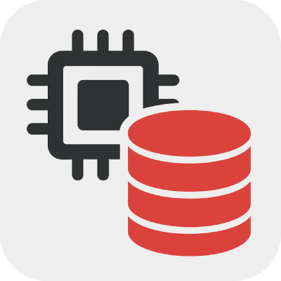

[](https://github.com/jasonyang-ee/IC-Lib/actions/workflows/publish.yml)
[](https://github.com/jasonyang-ee/IC-Lib/actions/workflows/testing.yml)

<h1 align="center">IC Lib</h1>
<h3 align="center">OrCAD Allegro Component Library Web Interface</h3>
<p align="center"></p>

## Features

- **Parts Library**: Browse and search a comprehensive library of PCB components.
- **Alternative Parts**: Suggest alternative components based on specifications.
- **Inventory Management**: Track component availability and stock levels.
- **Footprints & Symbols**: Access and download footprints and symbols for OrCAD.
- **Vendor Integration**: Fetch real-time data from popular electronic component distributors.
- **Project Management**: Organize components by projects for easy access. [TBD]
- **User Management**: Secure user authentication and role-based access control. [TBD]

## Getting Started

### Web Interface

- Access the web interface at `http://<host_ip>:80`

### Run Using Docker Compose

```yaml
services:
  iclib:
    build:
      context: .
      dockerfile: Dockerfile
    container_name: iclib
    restart: unless-stopped
    ports:
      - "80:80"          # All traffic (frontend + API via nginx proxy)
    environment:
      # Node Environment and API Port
      - NODE_ENV=production
      - PORT=3500
      
      # Database Connection (External PostgreSQL)
      # Update these to match your PostgreSQL server
      - DB_HOST=localhost
      - DB_PORT=5432
      - DB_USER=iclib
      - DB_PASSWORD=123456
      - DB_NAME=iclib
      
      # CORS Configuration
      - CORS_ORIGIN=*
      
      # Optional: API Keys for vendor integrations
      # - DIGIKEY_CLIENT_ID=your_client_id
      # - DIGIKEY_CLIENT_SECRET=your_client_secret
      # - MOUSER_API_KEY=your_api_key
      # - ULTRA_LIBRARIAN_TOKEN=your_token
      # - SNAPEDA_API_KEY=your_api_key
    volumes:
      - ./iclib/download/footprint:/app/download/footprint
      - ./iclib/download/symbol:/app/download/symbol
      - ./iclib/download/pad:/app/download/pad
  
  iclib-db:
    image: postgres:18
    container_name: iclib-db
    restart: unless-stopped
    ports:
      - "5432:5432"
    environment:
      - POSTGRES_USER=iclib
      - POSTGRES_PASSWORD=123456
      - POSTGRES_DB=iclib
    volumes:
      - ./iclib/database:/var/lib/postgresql/18/docker
```

### Docker Image

- [Docker Hub](https://hub.docker.com/r/jasonyangee/iclib)

  ```
  jasonyangee/iclib:latest
  ```

- [GitHub Container Registry](https://github.com/jasonyang-ee/iclib/pkgs/container/iclib)

  ```
  ghcr.io/jasonyang-ee/iclib:latest
  ```

### Supported Platforms

- Linux AMD64
- Linux ARM64
- Linux ARMv7


## Local Development

### Run Locally

- Linux

  ```bash
  ./local-start.sh
  ```


## Caddy Reverse Proxy with Subpath Support

```
iclib.domain.tld {
	handle_path /anypath* {
		reverse_proxy server.local:80
	}
}
```