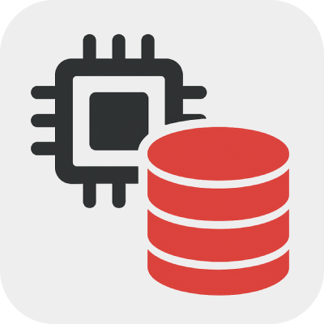

<h1 align="center">IC Lib</h1>
<h3 align="center">OrCAD Allegro Component Library Web Interface</h3>
<p align="center"></p>

## Features

- **Parts Library**: Browse and search PCB components.
- **Alternative Parts**: Bind alternative components.
- **CAD Files**: CAD file upload and management for symbols, footprints, 3D models, and spice models.
- **Vendor Integration**: Seach parts and fetch metadata from distributors.
- **Inventory Management**: Track component quantity and location.
- **Project Management**: Organize components by projects for easy access.
- **Engineer Change Order**: Enable ECO mode to control parts info update by approval stages.
- **User Management**: Secure user authentication and role-based access control.

## Getting Started

### Docker Compose

```yaml
services:
  iclib:
    build:
      context: .
      dockerfile: Dockerfile
    container_name: iclib
    restart: unless-stopped
    ports:
      - "80:80"          # All traffic (frontend + API via nginx proxy)
    environment:
      # Authentication Settings
      - JWT_SECRET=change-this-to-a-secure-random-string-in-production-minimum-32-characters
      - CONFIG_ECO=false  # Runtime feature flag for ECO menu/routes
      
      # Database Connection (External PostgreSQL)
      # Update these to match your PostgreSQL server
      - DB_HOST=localhost
      - DB_PORT=5432
      - DB_USER=iclib
      - DB_PASSWORD=123456
      - DB_NAME=iclib
      
      # Optional: API Keys for vendor integrations
      # - DIGIKEY_CLIENT_ID=your_client_id
      # - DIGIKEY_CLIENT_SECRET=your_client_secret
      # - MOUSER_API_KEY=your_api_key
    volumes:
      - ./iclib/library:/app/library
  
  iclib-db:
    image: postgres:18
    container_name: iclib-db
    restart: unless-stopped
    ports:
      - "5432:5432"
    environment:
      - POSTGRES_USER=iclib
      - POSTGRES_PASSWORD=123456
      - POSTGRES_DB=iclib
    volumes:
      - ./iclib/database:/var/lib/postgresql/18/docker
```

### Web Interface

- Access the web interface at `http://<host_ip>:80`

### Environment Variables
- `CONFIG_ECO=true`

  Enable ECO mode to process any parts update with approval stages.

### Docker Image
- Docker Hub
  
  [jasonyangee/iclib:latest](https://hub.docker.com/r/jasonyangee/iclib)


- GitHub Container Registry

  [ghcr.io/jasonyang-ee/iclib:latest](https://github.com/jasonyang-ee/iclib/pkgs/container/iclib)


### Image Supported Platforms

- Linux amd64
- Linux arm64


## Reverse Proxy with Subdirectory Support

### Caddy

```
iclib.domain.tld {
	@notrailing {
		path /anypath
	}
	redir @notrailing /anypath/ permanent
	
	handle_path /anypath/* {
		reverse_proxy server.local:80
	}
}
```

### Nginx

```nginx
server {
	listen 80;
	listen [::]:80;
	server_name iclib.domain.tld;

	# Redirect /anypath (no trailing slash) to /anypath/ (with trailing slash)
	# This ensures the SPA base path is correctly detected
	location = /anypath {
		return 301 $scheme://$host/anypath/;
	}

	# Proxy all requests under /anypath/ to the IC-Lib container
	location /anypath/ {
		proxy_pass http://server.local:80/;
		proxy_http_version 1.1;
		proxy_set_header Upgrade $http_upgrade;
		proxy_set_header Connection 'upgrade';
		proxy_set_header Host $host;
		proxy_set_header X-Real-IP $remote_addr;
		proxy_set_header X-Forwarded-For $proxy_add_x_forwarded_for;
		proxy_set_header X-Forwarded-Proto $scheme;
		proxy_cache_bypass $http_upgrade;
		
		# Handle large file uploads
		client_max_body_size 100M;
	}
}
```
