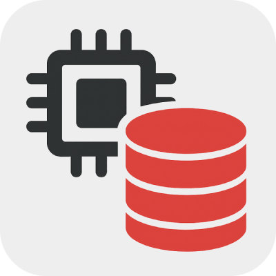

<h1 align="center">IC Lib</h1>
<h3 align="center">OrCAD Allegro Component Library Web Interface</h3>
<p align="center"></p>

## Features

- **Parts Library**: Browse and search PCB components.
- **Alternative Parts**: Bind alternative components.
- **CAD Files**: CAD file upload and management for symbols, footprints, 3D models, and spice models.
- **Vendor Integration**: Seach parts and fetch metadata from distributors.
- **Inventory Management**: Track component quantity and location.
- **Project Management**: Organize components by projects for easy access.
- **Engineer Change Order**: Enable ECO mode to control parts info update by approval stages.
- **User Management**: Secure user authentication and role-based access control.

## Getting Started

### Docker Compose

```yaml
services:
  iclib:
    build:
      context: .
      dockerfile: Dockerfile
    container_name: iclib
    restart: unless-stopped
    ports:
      - "80:80"          # All traffic (frontend + API via nginx proxy)
    environment:
      # Authentication Settings
      - JWT_SECRET=change-this-to-a-secure-random-string-in-production-minimum-32-characters
      - CONFIG_ECO=false  # Runtime feature flag for ECO menu/routes
	  # - CONFIG_BASE_URL=https://iclib.domain.tld/anypath/
      # - CONFIG_SUBDIRECTORY_PATH=/anypath/
      
      # Database Connection (External PostgreSQL)
      # Update these to match your PostgreSQL server
      - DB_HOST=localhost
      - DB_PORT=5432
      - DB_USER=iclib
      - DB_PASSWORD=change-this-to-a-secure-db-password-in-production-minimum-6-characters
      - DB_NAME=iclib
      
      # Optional: API Keys for vendor integrations
      # - DIGIKEY_CLIENT_ID=your_client_id
      # - DIGIKEY_CLIENT_SECRET=your_client_secret
      # - MOUSER_API_KEY=your_api_key
    volumes:
      - ./iclib/library:/app/library
  
  iclib-db:
    image: postgres:18
    container_name: iclib-db
    restart: unless-stopped
    ports:
      - "5432:5432"
    environment:
      - POSTGRES_USER=iclib
      - POSTGRES_PASSWORD=change-this-to-a-secure-db-password-in-production-minimum-6-characters
      - POSTGRES_DB=iclib
    volumes:
      - ./iclib/database:/var/lib/postgresql/18/docker
```

### Web Interface

- Access the web interface at `http://<host_ip>:80`

### Environment Variables
- `CONFIG_ECO=true`

  Enable ECO mode to process any parts update with approval stages.

- `CONFIG_BASE_URL`

  Set email link URLs to the server url + subdirectory if applicable, for example `https://iclib.domain.tld/anypath/`.

- `CONFIG_SUBDIRECTORY_PATH`

  Set the reverse proxy subdirectory path if the app is not able to run with sub CNAME routing. For example, if the app is served at `https://domain.tld/anypath/`, set `CONFIG_SUBDIRECTORY_PATH=/anypath/` to ensure the frontend router and asset paths work correctly.

- `RATE_LIMIT_*` / `TRUST_PROXY_HOPS`

  Optional rate-limit tuning (defaults apply when unset). Three budgets are enforced independently, so exhausting one never locks out the others:

  | Budget | Keyed by | Covers | Env |
  |---|---|---|---|
  | Login | Client IP | Failed `POST /api/auth/login` | `RATE_LIMIT_LOGIN_MAX`, `RATE_LIMIT_LOGIN_WINDOW_MS` |
  | Change password | Authenticated user id | Failed change-password attempts | `RATE_LIMIT_CHANGE_PASSWORD_MAX`, `RATE_LIMIT_CHANGE_PASSWORD_WINDOW_MS` |
  | Public ceiling | Client IP | Only the unauthenticated read surface plus the barcode lookup | `RATE_LIMIT_GLOBAL_MAX` (default 1000), `RATE_LIMIT_GLOBAL_WINDOW_MS` (default 15 min) |

  Authenticated requests do not spend the public ceiling, so a busy signed-in user cannot throttle guest reads coming from the same office NAT address — and cannot be throttled by them. `TRUST_PROXY_HOPS` is the number of proxy hops in front of Node (1 for the bundled nginx) so the limiters key on the real client address rather than the proxy's.

  The counters are held in the app process's own memory. They reset when the container restarts, and each process or replica keeps its own counts — the bundled `docker-compose.yml` runs a single app container, which is what makes these numbers authoritative. If you scale the app horizontally, configure a shared external store before treating the limits as uniformly enforced.

### Single Sign-On (OIDC)

IC-Lib supports Microsoft Entra ID directly through the Node/Express server. The primary Active Directory path is:

`Browser -> nginx -> Express backend -> Microsoft Entra ID via OIDC`

No ASP.NET gateway or identity broker is part of this path. Entra/AD provides authentication only: each user's role and active state are managed locally in IC-Lib. Identity-provider role and group claims are ignored.

For a single Entra tenant, prefer its tenant-specific issuer:

```env
OIDC_ISSUER_URL=https://login.microsoftonline.com/<tenant-id>/v2.0
OIDC_CLIENT_ID=<application-client-id>
OIDC_CLIENT_SECRET=<application-client-secret>
OIDC_REDIRECT_URI=https://iclib.example.com/api/auth/oidc/callback
OIDC_SCOPES=openid profile email
OIDC_PROVIDER_NAME=Microsoft Entra ID
OIDC_DEFAULT_ROLE=read-only
```

For a multi-tenant Entra registration, use the exact `/organizations` or `/common` issuer and set `OIDC_ALLOWED_TENANTS` to a nonempty comma-separated list of tenant GUIDs. IC-Lib disables those shared issuers when the allowlist is empty. A tenant-specific issuer can leave the allowlist unset.

```env
OIDC_ISSUER_URL=https://login.microsoftonline.com/organizations/v2.0
OIDC_ALLOWED_TENANTS=<tenant-guid-1>,<tenant-guid-2>
```

A generic OIDC provider is also supported: set the same variables with that provider's issuer, client, secret, and callback registration. Keep the minimal `openid profile email` scopes unless the provider requires another identity scope. No Keycloak deployment or runtime dependency is required.

On first sign-in, just-in-time provisioning assigns only `OIDC_DEFAULT_ROLE`; an IC-Lib admin then owns role changes, activation, and deactivation. A verified email links to a local account only when exactly one account matches; an unverified or ambiguous email never links. Local accounts remain available for break-glass access.

Deactivating an IC-Lib user now ends that user's existing session: every protected request re-checks the account's active state, so an already-issued token stops working on its next request instead of lasting out the remainder of its lifetime.

### Entra SCIM provisioning (optional)

IC-Lib can accept user lifecycle updates from Entra ID over SCIM 2.0. It is off unless both variables are set, and a partial or invalid configuration stops the server rather than serving provisioning behind an ambiguous credential:

```env
SCIM_TENANT_ID=<tenant-guid>
SCIM_BEARER_TOKEN=<random secret, at least 32 characters>
```

In the Entra enterprise application, under Provisioning:

- **Tenant URL**: `https://iclib.example.com/api/scim/v2` — HTTPS, reachable from Entra or your provisioning agent.
- **Secret Token**: the value of `SCIM_BEARER_TOKEN`. Generate one per deployment and rotate it by changing it in both places; it is never written to a log or a response.
- Leave **Groups** unmapped — only the User resource is supported — and scope provisioning to assigned users.
- The only matching property is `externalId` mapped from the Entra `objectId`. It is immutable; do not map `userName` or `mail` as a matching property, because those change.

**SSO comes first.** SCIM never creates or links an account: the local row is created by the user's first OIDC sign-in. Provisioning an identity that has never signed in returns 403 with an explanatory message, and the fix is one SSO login followed by *Provision on demand* or the next cycle. Test Connection succeeds regardless — Entra probes with a random object id, which correctly returns an empty result.

What SCIM may change is deliberately narrow: username, display name, email, and active state. Roles stay local — an IC-Lib admin owns them, and no identity-provider claim can grant or restore access. Disabling, unassigning, or deleting the user in Entra deactivates the IC-Lib row and keeps it, so authorship, approvals, and audit history keep resolving; re-enabling reactivates the same row with the same id. A deactivation takes effect on that user's next request once Entra has delivered it — Entra's provisioning cycle is incremental and eventual (typically within 40 minutes), and that delivery cadence is outside IC-Lib's control. For an immediate cutoff, deactivate the user in IC-Lib as well.

This is a single-tenant integration: requests carrying an object id from any other tenant see nothing.

### Docker Image
- Docker Hub
  
  [jasonyangee/iclib:latest](https://hub.docker.com/r/jasonyangee/iclib)


- GitHub Container Registry

  [ghcr.io/jasonyang-ee/iclib:latest](https://github.com/jasonyang-ee/iclib/pkgs/container/iclib)


### Image Supported Platforms

- Linux amd64
- Linux arm64


## Reverse Proxy with Subdirectory Support

Set `CONFIG_SUBDIRECTORY_PATH` to the public mount path when you deploy the app behind a subdirectory, for example `CONFIG_SUBDIRECTORY_PATH=/anypath/`. Keep `CONFIG_BASE_URL` set to the full public URL when email links should point back into that same path.

### Caddy

```
iclib.domain.tld {
	@notrailing {
		path /anypath
	}
	redir @notrailing /anypath/ permanent
	
	handle_path /anypath/* {
		reverse_proxy server.local:80
	}
}
```

Run the container with `CONFIG_SUBDIRECTORY_PATH=/anypath/` and `CONFIG_BASE_URL=https://iclib.domain.tld/anypath/`.

### Nginx

```nginx
server {
	listen 80;
	listen [::]:80;
	server_name iclib.domain.tld;

	# Redirect /anypath (no trailing slash) to /anypath/ (with trailing slash)
	# This ensures the SPA base path is correctly detected
	location = /anypath {
		return 301 $scheme://$host/anypath/;
	}

	# Proxy all requests under /anypath/ to the IC-Lib container
	location /anypath/ {
		proxy_pass http://server.local:80/;
		proxy_http_version 1.1;
		proxy_set_header Upgrade $http_upgrade;
		proxy_set_header Connection 'upgrade';
		proxy_set_header Host $host;
		proxy_set_header X-Real-IP $remote_addr;
		proxy_set_header X-Forwarded-For $proxy_add_x_forwarded_for;
		proxy_set_header X-Forwarded-Proto $scheme;
		proxy_cache_bypass $http_upgrade;
		
		# Handle large file uploads
		client_max_body_size 100M;
	}
}
```

Run the container with `CONFIG_SUBDIRECTORY_PATH=/anypath/` and `CONFIG_BASE_URL=https://iclib.domain.tld/anypath/`.
